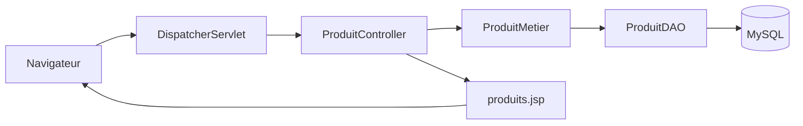

# Projet Spring MVC — Gestion des Produits

Application web CRUD développée avec l'architecture **Spring MVC + 3-Tiers** en utilisant **Spring Web MVC**, **JSP**, **JSTL**, **Hibernate**, **MySQL** et **Maven**.  
Elle permet d'**afficher**, **rechercher**, **ajouter**, **modifier** et **supprimer** des produits à partir d'une interface web simple.

---

## Architecture du projet




```text
springmvc/
├── src/main/java/
│   ├── controller/
│   │   └── ProduitController.java         ← Contrôleur Spring MVC
│   ├── dao/
│   │   ├── Produit.java                   ← Entité Hibernate Produit
│   │   ├── ProduitDAO.java                ← Interface CRUD
│   │   └── ProduitImpl.java               ← Implémentation Hibernate
│   └── services/
│       ├── ProduitMetier.java             ← Interface service métier
│       └── ProduitImplMetier.java         ← Implémentation du service
├── src/main/webapp/
│   ├── index.jsp                          ← Redirection vers /index
│   ├── pages/
│   │   └── produits.jsp                   ← Vue principale JSP
│   └── WEB-INF/
│       ├── web.xml                        ← Configuration web + DispatcherServlet
│       ├── application-servlet-config.xml ← Configuration Spring MVC
│       └── spring-beans.xml               ← Configuration Hibernate + Beans
└── pom.xml                                ← Dépendances Maven
```

---

## 1. Page d'accueil — `index.jsp`

Cette page joue le rôle de point d’entrée de l’application.  
Elle redirige automatiquement l’utilisateur vers la route Spring MVC `/index`, qui déclenche le chargement de la liste des produits.


---

## 2. Page principale — `produits.jsp`


La page `produits.jsp` est l’interface centrale de l’application. Elle permet :

- d’afficher tous les produits enregistrés
- de rechercher un produit par identifiant
- d’ajouter un nouveau produit
- de charger un produit en mode modification
- de mettre à jour ou supprimer un produit existant

Cette vue utilise **JSTL** avec `<c:forEach>` pour afficher dynamiquement la liste des produits.

---

## 3. Contrôleur principal — `ProduitController`

Le contrôleur Spring MVC gère toutes les actions de l’application via des routes annotées avec `@RequestMapping`.

### Routes disponibles

| URL | Méthode | Rôle |
|------|---------|------|
| `/index` | GET | Afficher tous les produits |
| `/searchProduct` | POST | Rechercher un produit par ID |
| `/addProduct` | POST | Ajouter un nouveau produit |
| `/deleteProduit` | GET | Supprimer un produit |
| `/editProduit` | GET | Charger un produit en modification |
| `/updateProduit` | POST | Mettre à jour un produit |

Exemple :

```java
@RequestMapping(value = "/index")
public String pageIndex(Model model) {
    model.addAttribute("listeProduit", services.getAllProduits());
    return "produits";
}
```

---

## 4. Couche service — `ProduitMetier`

La couche service joue le rôle d’intermédiaire entre le contrôleur et le DAO.  
Elle centralise les opérations métier liées aux produits :

- `addProduit`
- `deleteProduit`
- `getAllProduits`
- `getProduitById`
- `updateProduit`

Même si la logique métier reste simple dans ce projet, cette séparation améliore la maintenabilité et prépare l’application à évoluer.

---

## 5. Couche DAO — `ProduitDAO` / `ProduitImpl`

La couche DAO gère directement l’accès à la base de données via **Hibernate** et `SessionFactory`.

Les principales opérations réalisées sont :

- `save()` pour l’ajout
- `get()` pour la recherche par identifiant
- `createQuery("FROM Produit")` pour l’affichage complet
- `update()` pour la modification
- `delete()` pour la suppression

La classe `ProduitImpl` est annotée avec `@Transactional`, ce qui permet à Spring de gérer automatiquement les transactions.

---

## 6. Entité Hibernate — `Produit`

La classe `Produit` représente la table `produit` dans la base de données.  
Elle utilise les annotations JPA suivantes :

- `@Entity`
- `@Table(name = "produit")`
- `@Id`
- `@GeneratedValue(strategy = GenerationType.IDENTITY)`
- `@Column`

### Attributs principaux

| Attribut Java | Colonne SQL | Rôle |
|---------------|-------------|------|
| `idProduit` | `id_produit` | Identifiant du produit |
| `nom` | `nom` | Nom du produit |
| `description` | `description` | Description |
| `prix` | `prix` | Prix du produit |

---

## 7. Configuration Spring MVC

### `web.xml`

Le fichier `web.xml` :

- charge le contexte Spring racine via `ContextLoaderListener`
- déclare le `DispatcherServlet`
- mappe le servlet principal sur `/`
- définit `index.jsp` comme page d’accueil

### `application-servlet-config.xml`

Ce fichier configure :

- le scan automatique du package `controller`
- le `InternalResourceViewResolver`

```xml
<context:component-scan base-package="controller" />

<bean class="org.springframework.web.servlet.view.InternalResourceViewResolver">
    <property name="prefix" value="/pages/" />
    <property name="suffix" value=".jsp" />
</bean>
```

Ainsi, la vue logique `"produits"` correspond physiquement à :

```text
/pages/produits.jsp
```

---

## 8. Configuration Hibernate — `spring-beans.xml`

Le fichier `spring-beans.xml` contient :

- la configuration du `DataSource` MySQL
- le `LocalSessionFactoryBean`
- le `HibernateTransactionManager`
- le bean DAO
- le bean service

Il relie donc toute la couche de persistance à Spring.

Base utilisée :

```text
gestion_produits
```

Dialecte Hibernate :

```text
org.hibernate.dialect.MySQL8Dialect
```

---


---

## Technologies utilisées

| Technologie | Rôle |
|-------------|------|
| **Spring MVC** | Routage des requêtes et contrôleurs |
| **JSP + JSTL** | Vue dynamique |
| **Hibernate** | ORM / persistance |
| **MySQL** | Base de données relationnelle |
| **Spring ORM** | Intégration Spring + Hibernate |
| **Maven** | Gestion des dépendances et packaging |
| **Architecture 3-Tiers** | Séparation présentation / métier / données |

---

## Dépendances clés — `pom.xml`

```xml
<!-- Spring MVC -->
<dependency>
    <groupId>org.springframework</groupId>
    <artifactId>spring-webmvc</artifactId>
    <version>5.3.30</version>
</dependency>

<!-- Spring ORM -->
<dependency>
    <groupId>org.springframework</groupId>
    <artifactId>spring-orm</artifactId>
    <version>5.3.30</version>
</dependency>

<!-- Hibernate Core -->
<dependency>
    <groupId>org.hibernate</groupId>
    <artifactId>hibernate-core</artifactId>
    <version>5.6.15.Final</version>
</dependency>

<!-- MySQL Driver -->
<dependency>
    <groupId>mysql</groupId>
    <artifactId>mysql-connector-java</artifactId>
    <version>8.0.33</version>
</dependency>

<!-- JSTL -->
<dependency>
    <groupId>jstl</groupId>
    <artifactId>jstl</artifactId>
    <version>1.2</version>
</dependency>
```

---

## Fonctionnalités implémentées

- affichage de tous les produits
- recherche d’un produit par identifiant
- ajout d’un produit
- suppression d’un produit
- modification d’un produit existant
- intégration Spring MVC + Hibernate + MySQL

---

## Lancement

1. Créer la base de données `gestion_produits` dans MySQL.
2. Vérifier les paramètres de connexion dans `src/main/webapp/WEB-INF/spring-beans.xml`.
3. Importer le projet dans **Eclipse** avec `Import -> Existing Maven Projects`.
4. Configurer **Tomcat 9** dans Eclipse.
5. Lancer le projet avec `Run As -> Run on Server`.
6. Accéder à l’application via :

```text
http://localhost:8080/springmvc/
```


*Projet Spring MVC — Gestion des Produits avec Hibernate et MySQL*
